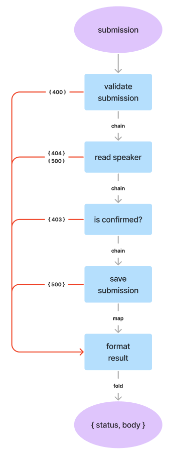

Code Sample supporting our workshop at [Codemotion Workshop Fest 2022](https://events.codemotion.com/conferences/online/2022/workshop-fest).

# `fp-ts`: l’approccio pragmatico usato da App IO


Agenda:
* [`fp-ts`: cos’è e perché usarla](#fp-ts-cosè-e-perché-usarla)
* [Tipi e operazioni essenziali](#tipi-ed-operazioni-essenziali)
* [Un caso reale: costruiamo un http endpoint](#un-caso-reale-costruiamo-un-http-endpoint)
* [Conclusioni e Q&A](#conclusioni-e-qa)

<details>
  <summary>Istruzioni</summary>
  Gli esempi sono pensati per funzionare con Node.js 14. Per installare le dipendenze si può usare sia `npm` che `yarn`
  
  ```bash
  npm ci
  # oppure
  yarn install --frozen-lockfile
  ```

  Build:
  ```bash
  npm run build
  # oppure
  yarn build
  ```

  Eseguire l'esempio: 
  ```bash
  npm run example01
  # oppure
  yarn example01
  ```
</details>

---

## `fp-ts`: cos’è e perché usarla
Vedi slides.

## Tipi ed operazioni essenziali
> *Gli esempi sono riportati in [src/walkthroughs](src/walkthroughs;)*

Facciamo una panoramica del set minimo di strumenti di cui abbiamo bisogno. Presenteremo:
* 3 Data Type
* 5 operazioni

### Che cos'è un Data Type in `fp-ts`?
Possiamo immaginare un Data Type come una scatola che contiene il valore che stiamo elaborando. Implementa le regole algebriche che ne determinano la componibilità, quindi le caratteristiche con cui il nostro valore può essere combinato con altri oggetti.

Si può immaginare un Data Type come le forme dei pezzi di un puzzle: gli "innesti" sono determinati sia dal Data Type stesso che dal tipo del valore contenuto.
Possiamo quindi combinare Data Type i cui "innesti" sono compatibili tra loro. Inoltre **siamo obbligati ad utilizzare tutti gli "innesti"** esposti da un Data Type.

TODO: immagine puzzle

### Data Type: `Option`
Un `Option` serve ad esprimere la presenza o meno di un valore. Il caso d'uso tipico è la ricerca di un singolo elemento all'interno di una collezione, che può tornare uno o zero elementi; si usa anche per gestire parametri opzionali.

Un `Option` è definito come l'unione di due tipi, `Some` e `None`, che indicano la presenza o meno del valore:
```ts
type Option<A> = None | Some<A>;
```
Diremo che `Option` è **istanza di Some** in presenza del valore, **istanza di None** nel caso contrario.

Il modo più elementare di costruire un `Option` è usare gli appositi costruttori:
```ts
import * as O from "fp-ts/Option";

O.some(42) // Option<number>
O.none // Option<never>
const myVar: object;
O.some(myVar) // Option<object>
//     ^^^^^ può essere null!!
```
Questo approccio può andare bene quando **siamo sicuri** che il valore sia effettivamente presente. 

### Operazione: `from*`
Un altro modo, sicuramente più solido e quindi più usato, è quello di usare l'operazione `fromNullable` che crea l'`Option` a partire da un valore arbitrario:
```ts
const myVar: object;
O.fromNullable(myVar) // Option<object>
//                       ^^^ può essere sia None che Some<object>, a seconda del contenuto della variabile
```
Anche `fromNullable` può essere definito un costruttore, però aggiunge una certa _intelligenza_ all'operazione. Ha senso quindi parlarne a parte, magari definendolo come [smart constructor](https://dev.to/gcanti/functional-design-smart-constructors-14nb). `fp-ts` mette a disposizione molti smart contructor. In questa esposizione ne vedremo alcuni: `fromEither`, `fromOption`, `fromPredicate`, etc.  Li raggruppiamo nella categoria `from*`.

<details>
  <summary>Moduli e convenzioni di sintassi</summary>
  Ad ogni Data Type corrisponde un modulo omonimo contenente i metodi e i tipi associati.

  In questa esposizione riproponiamo la convenzione che abbiamo usato in tutta la nostra codebase: importiamo tutti i metodi e gli attributi del modulo in una variabile che l'iniziale maiuscola del Data Type. Quindi:
  ```ts
  import * as O from "fp-ts/Option";
  import * as E from "fp-ts/Either";
  import * as TE from "fp-ts/TaskEither";
  ```
  Questo per avere un codice asciutto mantenendo il contesto dei metodi. Ad esempio, per usare `map()` avremo a disposione `O.map()` e `E.map()`.

  Un'alternativa è quella di usare il tipo come suffisso delle operazioni. A noi non piace e non la usiamo, ma è altrettanto valida.
  ```ts
  import { map as mapOption } from "fp-ts/Option";
  import { map as mapEither } from "fp-ts/Either";
  ```

  Infine, per le utility abbiamo la convenzione di importare le singole operazioni:
  ```ts
  import { pipe, flow, identity } from "fp-ts/function";  
  ```
</details>


### Operazione: `is*`
Come si può utilizzare il valore contenuto dall'`Option`? Il modo più diretto è accedere all'attributo `value`, che però è definito solamente per istanze di `Some`. Occorre quindi utilizzare il [_type narrowing_  di Typescript](https://www.typescriptlang.org/docs/handbook/2/narrowing.html) per ricondurci a quel caso:
```ts
const maybeFoo = O.some("foo");

maybeFoo.value;
//      ^^^^ Build error: value non è definito per Option<string>

if (O.isSome(maybeFoo)) {
  console.log(maybeFoo.value); // "foo"
} else {
  console.error(maybeFoo.value);
  //            ^^^^ Build error: value non è definito per None
}
```
Le funzioni `isSome` e `isNone` sono delle _type guard_, `fp-ts` ne mette a disposizione diverse a seconda del contesto e del Data Type. Le raggruppiamo nella categoria `is*`.

Questo modo di accedere al valore contenuto lascia per strada molti dei vantaggi di usare un Data Type e quindi tendiamo ad evitare di usarlo. Tuttavia ha i suoi casi d'uso:
* quando si introduce `fp-ts` all'interno di una procedura scritta senza 
* nei test, dove si predilige immediatezza ed espressività rispetto alla solidità della procedura

### Operazione: `map`
Tramite questa operazione possiamo applicare una trasformazione al valore contenuto **senza uscire dal contesto del Data Type**:
```ts
const toEuro = (n: number): string => `€${n}`;
const toMaybeEuro = O.map(toEuro); // "eleva" toEuro per funzionare con Option

toMaybeEuro(O.some(42)); // Option<string>
toMaybeEuro(O.none); // Option<string>
```
La funzione `toEuro` viene eseguita solo per istanza di `Some` e ignorata per istanze `None`. 
`toMaybeEuro` invece è una funzione che accetta un'istanza di `Option` e ne crea un'altra contenente il nuovo valore. È importante notare che la nuova istanza sarà a sua volta istanza di `Some` e di `None` a seconda che l'`Option` di partenza fosse rispettivamente un `Some` o un `None`. In termini pratici, **map conserva sia il Data Type che il tipo "base"**.

La sintassi usata può essere migliorata con l'utility `pipe`:
```ts
const toEuro = (n: number): string => `$${n}`;

const result = pipe(
  42,
  O.some,
  O.map(toEuro),
  O.map(value => {
    console.log(value); // "€42"
  })
); 
// Domanda: qual è il tipo di result?
```

`pipe` accetta un valore e una serie di funzioni _unarie_ (che accettano esattamente un parametro) che vengono eseguite in serie con il risultato della funzione precedente.
Tramite `pipe` è facile applicare più trasformazioni in serie:
```ts
const applyDiscount = (perc: number) => 
  (n: number): number => n * (1 - perc / 100);
const toRounded = (digits: number) =>
  (n: number): number => Math.round(n * 10 ** digits) / 10 ** digits;
const toEuro = (n: number): string => `$${n}`;

pipe(
  myPrice,
  O.fromNullable,
  O.map(applyDiscount(35)),
  O.map(toRounded(2)),
  O.map(toEuro)
);
```

### Operazione: `chain`
Anche `chain` applica delle trasformazioni al valore contenuto, ma a differenza di `map` può cambiare se il risultato sia istanza di `Some` o `None`. Si utilizza quando si vogliono mettere in serie due o più valori che potrebbero essere null-ish.
```ts
type Product = { name: string; price: number; };
const products = new Map<string, Product>();

const getFinalPrice = (productId: string): O.Option<string> =>
  pipe(
    productId,
    O.fromPredicate(s => s.length > 0), // Un altro smart constructor!
    O.chain(id => {
        const product = products.get(id);
        return product ? O.some(product) : O.none;
        // o meglio: O.fromNullable(product)
    }),
    O.map(product => product.price),
    O.map(applyDiscount(35)),
    O.map(toRounded(2)),
    O.map(toEuro)
  );
```

### Operazione: `fold`
Con questa operazione entrambi i "rami" dell'elaborazione (`Some` e `None`) vengono collassati in un unico ramo. Il risultato può essere un valore o un altro Data Type su cui lavorare. 
Un caso di utilizzo è quando si vuole di uscire dal contesto del Data Type per lavorare direttamente sul valore.
```ts

pipe(
   productId, 
   getFinalPrice,
   O.fold(
       () => "Cannot find product, sorry :(",
       price => `You will pay ${price}`
   ),
   console.log // Domanda: cosa scrive sul log?
)
```

### Data Type: `Either`
Introduciamo un nuovo Data Type su cui operare: `Either`. `Either` esprime il risultato di una computazione che può essere esclusivamente di un tipo o di un altro. In pratica divide la computazione in due rami, `Left` e `Right`; la sua definizione quindi sarà
```ts
type Either<L, R> = Left<L> | Right<R>
``` 
Sebbene in teoria non ci sia differenza di significato tra i due rami, la convezione è che il ramo `Right` esprima lo _happy path_ mentre il ramo `Left` sia dedicato alla gestione degli errori.

I casi d'uso più comuni di `Either` sono la validazione dell'input e il risultato di operazioni che possono fallire.

Come si usare un `Either`? In maniera del tutto simile a `Option`. Possiamo creare un `Either` tramite i suoi costruttori:
```ts
import * as E from "fp-ts/Either";

E.right(42);
E.left("not 42");

const validatePrice = (price: number): E.Either<string, number> =>
    price >= 0
        ? E.right(price)
        : E.left("price cannot be negative")
```

O usare degli appositi _smart constructor_:
```ts

// a partire da un'istanza di Option
pipe(
    O.some(42),
    E.fromOption(() => "cannot handle null-ish values")
)

// o da operazioni che possono fallire sollevando un'eccezione
E.tryCatch(
  () => JSON.parse('{"baz":true}'),
  exception => new Error()
);
```
È importante notare che in entrambi i casi è stato necessario fornire allo _smart constructor_ istruzioni su come gestire il ramo negativo.

Anche su `Either` sono definite le operazioni `is*`, `map`, `chain` e `fold`:
```ts
const fooOrError = E.right("foo");

if (E.isRight(fooOrError)) {
  console.log(fooOrError.right);
  console.log(fooOrError.left);
  //            ^^^^ Build error: left non è definito per Right
} else {
  console.log(fooOrError.left);
  console.log(fooOrError.right);
  //            ^^^^ Build error: right è definito per Left
}

const checkMinPrice = (price: number): E.Either<string, number> =>
  price >= 10 // arbitrary treshold, just an example
    ? E.right(price)
    : E.left("price cannot be less than 10");

pipe(
  price,
  validatePrice,
  E.map(applyDiscount(23)),
  E.chain(checkMinPrice),
  E.foldW(
    reason => new Error(reason),
    toEuro
  )
)
```
<details>
  <summary>Perché `foldW`?</summary>
  Perché il tipo tornato dal caso left è diverso dal caso right.
  `W` sta per Wide, ovvero "allarga" il tipo per accogliere entrambi.
  In pratica: una union.
</details>;


Un particolarità di `Either` rispetto ad `Option` è la presenza di `mapLeft`: stesso concetto di `map` ma applicato al ramo negativo. Si usa molto spesso per mappare gli errori su tipi coerenti a tutta la pipe:
```ts
pipe(
  price,
  validatePrice,
  E.mapLeft(failure => new Error(`Validation error: ${failure}`))
  E.map(applyDiscount)
);
```
Attenzione con `mapLeft`: si applica a **qualsiasi** `Left` precedente, non solo a quello prodotto dal `chain` immediatamente sopra. Ad esempio:
```ts
pipe(
  1, // checkMinPrice fallirà
  validatePrice,
  E.mapLeft(failure => new Error(failure)),
  E.chain(checkMinPrice),
  E.mapLeft(failure => {
      //    ^^^ Error | string
      // failure può arrivare sia da validatePrice che da checkMinPrice
  })
);
```  
Un modo consueto di risolvere è usare delle pipe innestate:
```ts
pipe(
  1,
  validatePrice,
  E.mapLeft(failure => new Error(failure)),
  E.chain(price =>
    pipe(
      price,
      checkMinPrice,
      E.mapLeft(failure => {
        //      ^^^ failure può arrivare SOLO da checkMinPrice
      })
    )
  )
);
```

### Data Type: `TaskEither`
`TaskEither` l'ultimo Data Type che includiamo tra gli essenziali. Rappresenta **un'operazione asincrona che può fallire** e, come si intuisce dal nome, è definito come un `Task` che ritorna un `Either`
```ts
type Task<T> = () => Promise<T>

type TaskEither<L, R> = () => Promise<Either<L, R>>
```
Fondamentale evidenziare che **un `TaskEither` ritorna una Promise che non fallisce mai**; l'eventuale fallimento sarà rappresentato dal ramo `Left`.

Possiamo maneggiare un `TaskEither` esattamente come faremmo con un `Either`:
```ts
import * as TE from "fp-ts/TaskEither";

TE.right(42);
TE.left("not 42");

TE.tryCatch(
  () => Promise.resolve(42),
  failure => new Error("unknown failure")
);

const processPayment = async (price: number) => {
    return processPaymentOnProvider();
}

const procedure = pipe(
  myPrice,
  validatePrice,
  E.map(applyDiscount(30)),
  E.chain(checkMinPrice),
  TE.fromEither,
  TE.chain(actualPrice =>
    TE.tryCatch(
      () => processPayment(actualPrice),
      err => "è successo qualcosa durante il pagamento"
    )
  ),
  TE.map(_ => "OK"),
  // questo fold è sostituito da TE.toUnion
  TE.fold(
    _ => async () => _,
    _ => async () => _
  )
);

procedure().then(result => {
    console.log(result)
});
```

### Sommario

|Data Type|Si usa per|
|-|-|
|`Option`| Un valore che c'è o è null-ish|
|`Either`| Validazione, operazione che può fallire |
|`TaskEither`| Operazione **asincrona** che può fallire|

|Operazione|Si usa per|
|-|-|
|`is*`| _type narrowing_ di un TypeClass in un sotto-tipo|
|`from*`| Costruire un Data Type a partire da un valore o un altro Data Type |
|`map`| Applicare una trasformazione al valore contenuto senza cambiare il sotto-tipo |
|`chain`| Applicare una trasformazione al valore contenuto cambiando il sotto-tipo |
|`fold`| Far convergere i due rami della computazione |


## Un caso reale: costruiamo un http endpoint

### Scenario
> Esporre un endpoint che permetta di sottomettere un Talk per uno Speaker. 
>
> Il Talk deve avere un titolo lungo tra i 30 e i 70 caratteri e una descrizione di massimo 3000 caratteri.
>
> Un Talk deve far riferimento ad uno Speaker già registrato e confermato.

<details>
  <summary>Specifica OpenAPI</summary>

  ```yaml
  openapi: 3.0.3
  info:
    title: Example
    version: 0.1.0
  paths:
    /talks:
      post:
        operationId: SubmitTalk
        responses:
          200:
            description: Submission accepted
            content:
              application/json:
                schema:
                  $ref: "#/components/schemas/Submission"
          400:
            description: Invalid parameters
            content:
              text/plain:
                schema:
                  type: string
          403:
            description: Speaker not confimed
          404:
            description: Speaker not found
          500:
            description: Server Error
            content:
              text/plain:
                schema:
                  type: string
  components:
    schemas:
      Submission:
        type: object
        properties:
          title:
            type: string
          abstract:
            type: string
          speakerId:
            type: string
  ```
</details>

### Flowchart


### Codice
```ts
export default (input: unknown): Promise<EndpointResponse> =>
  pipe(
    input,
    // validate submission
    validateSubmission,
    TE.fromEither,
    TE.mapLeft(reason => invalidParameters(reason)),

    // check if the speaker exists and is confirmed
    TE.chain(sub =>
      pipe(
        TE.tryCatch(
          () => readSpeakerById(sub.speakerId),
          _ => serverError("failed to retrieve speaker informations")
        ),

        TE.chain(maybeSpeaker =>
          pipe(
            maybeSpeaker,
            O.fromNullable,
            TE.fromOption(() => speakerNotFound())
          )
        ),

        TE.chain(speaker =>
          speaker.confirmed ? TE.right(speaker) : TE.left(speakerCannotSubmit())
        ),

        TE.map(_ => sub)
      )
    ),

    TE.chain(sub =>
      TE.tryCatch(
        () =>
          saveTalk({
            abstract: sub.abstract,
            speakerId: sub.speakerId,
            title: sub.title
          }),
        _ => serverError("failed to save talk")
      )
    ),

    TE.map(sub => success(sub)),
    TE.toUnion
  )();
```

## Conclusioni e Q&A
Vedi slides
